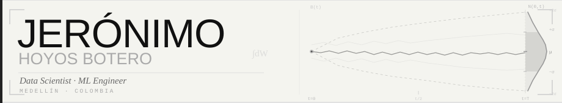

---

## Who I am

I'm a **Systems and Computer Engineering** student at Universidad Nacional de Colombia, obsessed with understanding problems before solving them.

I work at the intersection of **statistics**, **linear algebra**, and **machine learning**. What drives me isn't just building models that work — it's understanding *why* they work and what they reveal about the problem's structure.

I keep up with the AI state of the art and apply **GPU-accelerated computing** when scale demands it. Outside of code you'll find me reading, with my cats, or thinking about math.

---

## Tech Stack

**Languages**

**Data Science**

**Deep Learning & AI**

**GPU Computing**

**Visualization & Apps**

**Dev & Tools**

---

## Projects

<table>
<tr>
<td width="50%" valign="top" align="center">

### Molinete-AI
`Python · Rust`

Transformer built from scratch in Rust — efficient tensor operations and deep learning architectures without frameworks. Presented at the *Medellín IA community* at EPAM Medellín.

</td>
<td width="50%" valign="top" align="center">

### InvestigIA
`Python · LangGraph`

Autonomous scientific research assistant built with LangGraph and Ollama. Fully local inference. 3rd place at DataHack 2026.

</td>
</tr>
<tr>
<td width="50%" valign="top" align="center">

### Analysis and Modeling of Smoking
`Python · Jupyter`

EDA and ML modeling on the Body Signals of Smoking dataset — predicting smoking habits from physiological signals.

</td>
<td width="50%" valign="top" align="center">

### Efficient Krylov Sequence Computation on GPU
`CUDA · Python`

CUDA benchmarking for Krylov subspace generation. CPU vs GPU comparison with tiled, coalesced and cuBLAS strategies.

</td>
</tr>
</table>

---

## GitHub Stats

---

Medellín, Colombia · obsessed with understanding problems before solving them

"# JeroHoyos" 
