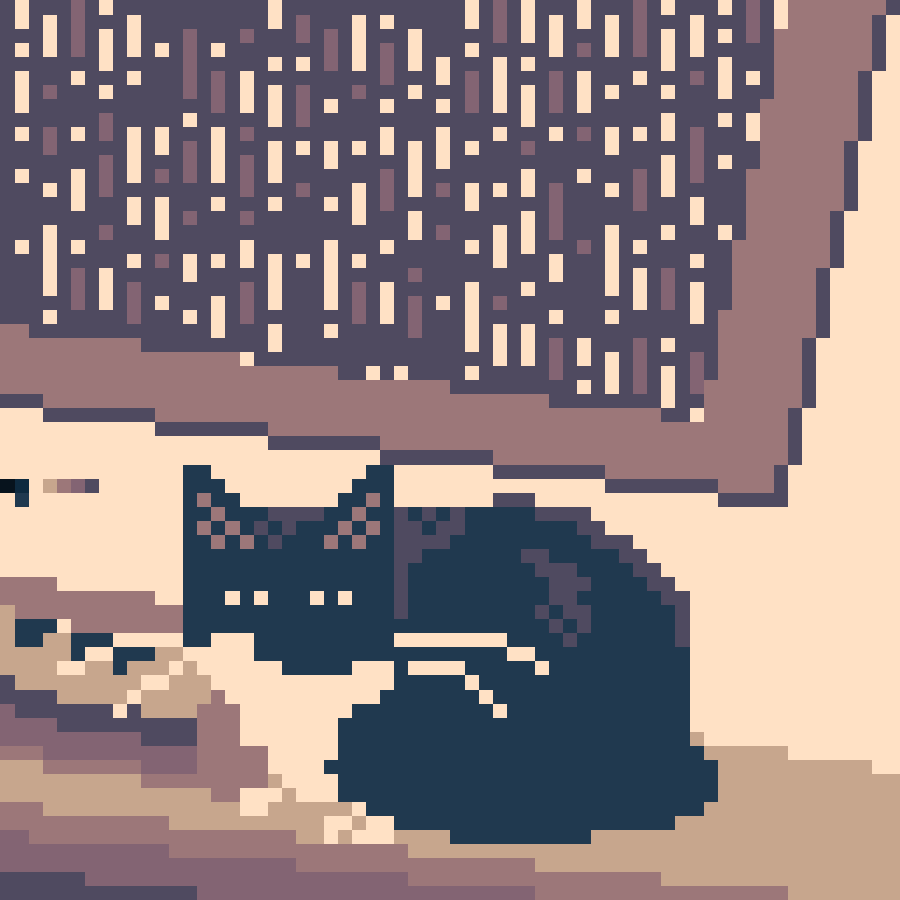

    
    <h1>Hi, I'm Jerónimo Hoyos Botero</h1>
    
    
    

## About me

I'm a machine learning enthusiast currently studying at the Universidad Nacional de Colombia. I love cats, coding, and math. I sometimes give animated talks, and I coordinate Aperture, a student research group at my university.

## Talks

- **PyCon Colombia 2026**: Building a Transformer with Rust
- **Python Medellín x Medellín AI**: How do neural networks work? A visual introduction
- **Aperture Systems**: Introduction to Git and GitHub

## Featured projects

| Project | Description |
| --- | --- |
| [Molinete-AI](https://github.com/JeroHoyos/Molinete-AI) | A GPT-2 Transformer built from scratch in Rust, trained on the works of Cervantes. |
| [Sanghelios](https://github.com/JeroHoyos/Sanghelios) | Predicts blood shortages 14 days in advance and generates AI-designed donation campaigns. |
| [InvestigIA](https://github.com/JeroHoyos/InvestigIA) | Autonomous research assistant with LangGraph and Ollama. 3rd place at DataHack 2026. |
| [VertexRS](https://github.com/JeroHoyos/VertexRS) | A 3D software renderer written in Rust. |
| [CATlude](https://github.com/JeroHoyos/CATlude) | A tiny coding agent, like Claude Code, but with a cat. |

---

    Cat GIF from <a href="https://giphy.com/gifs/pixel-animals-cats-sZPQXNBBN7mbDALod9">GIPHY</a>

